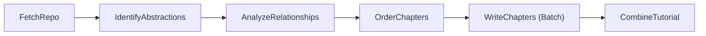

Here’s the complete blog‑style tutorial with an expanded deep‑dive for Section 2:

---

## Quick Take

PocketFlow Tutorial is a minimalist, LLM‑driven framework that transforms any public GitHub repository into a step‑by‑step, beginner‑friendly tutorial. It does this by crawling the repo, identifying core abstractions and their relationships, ordering them logically, then writing out Markdown chapters—all in under 100 lines of orchestration code. The secret sauce is a simple “Flow” engine that runs five sequential nodes, each invoking Google’s Gemini API via a shared client, plus a dynamic batch step to author each chapter. Finally, a tiny Mesop/FastAPI demo UI lets you paste in a repo URL and watch the magic happen live.

---

## 1. What It Is and Why It Matters

PocketFlow Tutorial automates the painful first step of onboarding into a new codebase—understanding its structure and concepts—by having an LLM act as your personal teacher.

- **Transforms code → tutorial** in one command, producing polished Markdown with diagrams and analogies.
    
- **Uses ~1000 lines** of Python code (33 lines flow.py + 111 lines main.py + 880 lines nodes.py) on top of PocketFlow's Flow‑as‑code abstraction.
    
- **Live demo at Code2Tutorial.com** shows instant generation with no install—just paste a GitHub link and go.
    

---

## 2. Core Architecture: Flow & Nodes (Deep Dive)

At the heart of PocketFlow Tutorial lies a minimal **Flow engine** that orchestrates a **fully sequential pipeline** of six specialized **Nodes**, each with a single responsibility. This design keeps the codebase modular, transparent, and easy to extend.



### 2.1 Why a Sequential Flow?

- **Simplicity & Traceability:** You can trace exactly how data transforms—from raw files to final chapters—step by step.
    
- **Modularity:** Tweak or replace any piece (e.g., how abstractions are extracted) by modifying a single Node.
    
- **Controlled LLM Usage:** Isolated prompts limit token usage per call, and you can cache or mock individual nodes in testing.
    

### 2.2 Node Breakdown

1. **FetchRepo**
    
    - **What it does:** Crawls the GitHub URL (or local directory), reads and filters files, and builds an in‑memory file context.
        
    - **Why it matters:** Provides the raw source code and comments for all downstream analysis.
        
2. **IdentifyAbstractions**
    
    - **What it does:** Sends a prompt asking the LLM to identify the top 5–10 core concepts (“abstractions”) in the codebase.
        
    - **How it works:**
        
        - Concatenates selected files into a single context string.
            
        - Prompts for each abstraction’s name, beginner‑friendly description, and related file indices.
            
        - Parses the YAML response into structured Python objects.
            
3. **AnalyzeRelationships**
    
    - **What it does:** Asks the LLM to map out how those abstractions interact, producing a graph of “from → to” edges.
        
    - **How it works:**
        
        - Feeds the abstraction list plus code snippets into a structured prompt.
            
        - Receives a summary and a YAML list of labeled relationships.
            
4. **OrderChapters**
    
    - **What it does:** Determines the pedagogically optimal order to teach the abstractions—starting with foundations, then layering on complexity.
        
    - **How it works:**
        
        - Combines the relationship graph and project summary.
            
        - Prompts for an ordered YAML list of abstraction indices with comments.
            
5. **WriteChapters** (Batch Node)
    
    - **What it does:** For each abstraction in the chosen order, generates a standalone Markdown chapter.
        
    - **How it works:**
        
        - Loops _n_ times (one per abstraction).
            
        - For each, sends a prompt with the abstraction’s description, relevant code snippets, and summaries of previously written chapters.
            
        - Ensures narrative flow and avoids repetition by including “chapters_written_so_far” in the prompt.
            
6. **CombineTutorial**
    
    - **What it does:** Stitches together all generated chapters into an `index.md`, injects a Mermaid diagram of the abstraction graph, and emits the final tutorial folder.
        
    - **How it works:** Pure file I/O and templating—no LLM calls.
        

### 2.3 Key Takeaways

- **Single Responsibility:** Each Node does exactly one thing.
    
- **Prompt‑Driven Intelligence:** All “smarts” live in concise prompt templates; the orchestration code remains tiny.
    
- **Stateless Calls:** Each LLM invocation stands alone—there’s no hidden chat history or system messages.
    
- **Predictable & Extendable:** You can instrument, cache, or swap out any Node without touching the others.
    

---

## 3. LLM Integration: One Client, Many Calls

All LLM work goes through a single `genai.Client` constructor in `utils/call_llm.py`. That client is instantiated once per call, and every Node simply passes a tailored YAML‑style prompt to it as a **user** message (no “system” role or chat history). This keeps the codebase tidy:

- **One live instantiation** for AI Studio/Gemini.
    
- **Two commented examples** for Vertex AI mode—just uncomment to switch.
    

Switching providers is trivial, and you only pay for what you use on your Google Cloud account.

---

## 4. Demo UI: Web Interface

The tutorial generation is available as a web service at [code2tutorial.com](https://code2tutorial.com/). While the blog mentions Mesop + FastAPI, these UI components are not included in the main repository—only the core tutorial generation logic is provided.

For local use, run the command-line interface as shown in the usage section.

---

## 5. Hosting & Cost Model

You can run everything locally:

```bash
pip install pocketflow google-genai mesop fastapi uvicorn
export GEMINI_API_KEY=…
uvicorn main:app --reload
```

There’s also a free online demo at [code2tutorial.com](https://code2tutorial.com/) where the maintainers currently absorb all hosting and API costs for end users—no paywalls or per‑use fees. If you self‑host, you’ll be billed by Google for Gemini/Vertex AI calls and by your cloud provider for compute.

---

## 6. Putting It All Together

1. **Run the Flow**
    
    ```bash
    python main.py --repo https://github.com/your/repo --output tutorial
    ```
    
2. **Browse the Result**  
    Open `tutorial/index.md` to see a full tutorial complete with a Mermaid diagram of your abstraction graph.
    

In under a minute, you’ll have a full‑fledged tutorial custom‑tailored to any codebase—even one you’ve never seen before. Enjoy exploring new projects with your AI co‑pilot!